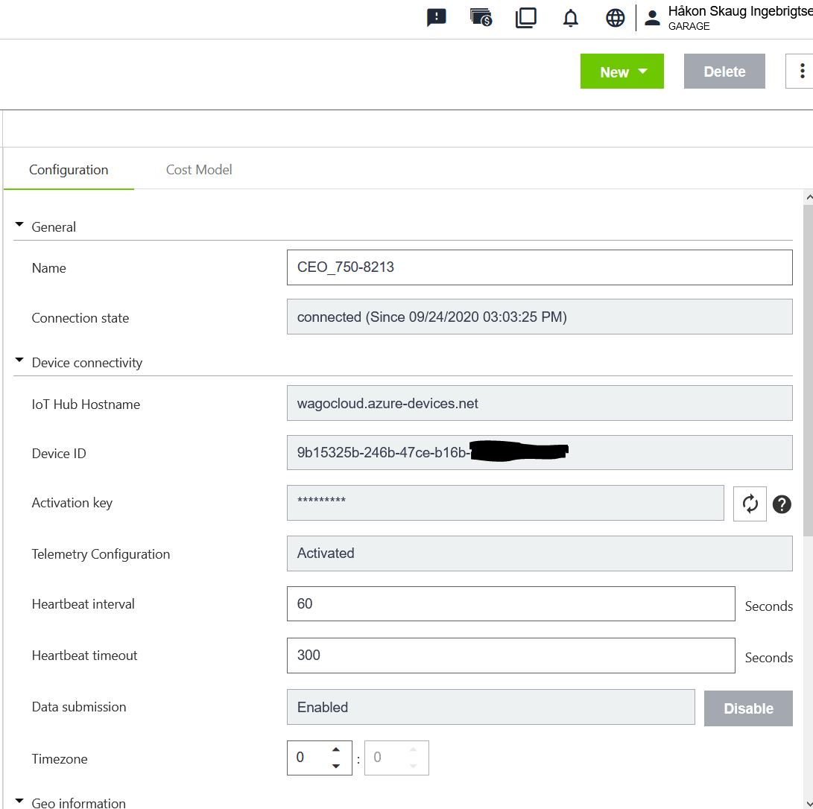
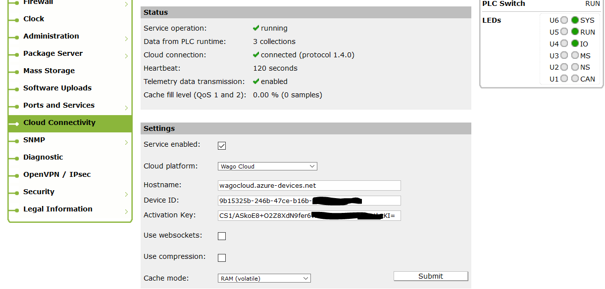
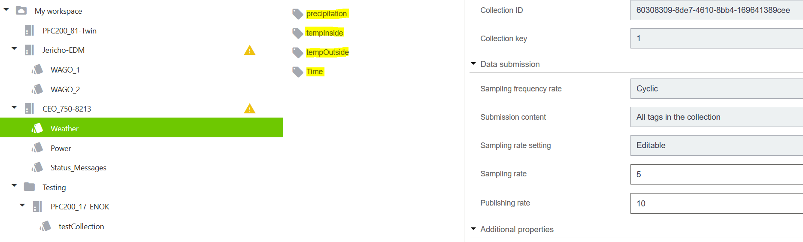
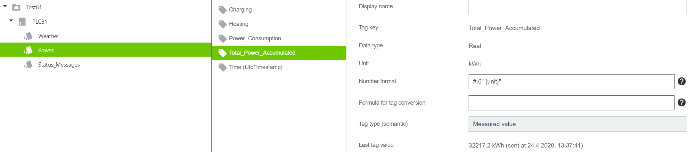

# Wago Cloud with PFC200
This folder will walk through how to connect to Wago Cloud, how to send and receive data and commands, and more. Stay put! :)

(PLCtoCloud.st) shows how to setup data export to the Wago Cloud.
More examples will be posted here.

### Prerequisites
- An account on cloud.wago.com
- E!Cockpit
- PFC100/200 with FW12 or newer, and internet connection

## Setup
### Wago Cloud
After creating an account, a subscription and a device must be configured - a subscription is similar to a project. Create a subscription, then move to Device Management to configure your PLC. Go to Configuration, and click New in the top right corner > Add a device.

After adding a device, you will see properties and details for that device on the right side (Configuration tab). The following details will be needed in the next step, and should be copied:
- IoT Hub Hostname: wagocloud.azure-device.net
- Device ID
- Activation Key 

  

### Web-Based Management
To enable cloud connectivity, log in to WBM: Connect to the PLCs' IP in your web browser (For more information go to the start page for this wiki).
Under Cloud Connectivity: Enable > Then input the necessary that you retrieved from your cloud subscription. 

  

If your PLC does not have an internet connection yet, configure this under Networking.

Lastly, set the correct time under Clock. Enabling a NTP server might be helpful, under Ports and Services.

### E!Cockpit application
The "PLCtoCloud.st" file located in this Github folder shows how it is implemented. Moreover, the example located in E!Cockpit under Sample Applications can show this. The cloud examples utilize the "FbCollectionLogger" function block which can be found in WagoAppCloud. 

As the application is designed, it is necessary to declare the collections that will contain all variables, and declare all members of the collections. After doing this, the function block is run. 
The declaration of the collection must specify sample and publish rates, the number of tags it shall contain, publish mode, etc. The declaration of each tag must contain data type, name, unit, etc.

The data will reach the cloud after following these steps. You can observere and configure the tags under Device Management > Configuration > Device > Collection > Tag.

  

  

