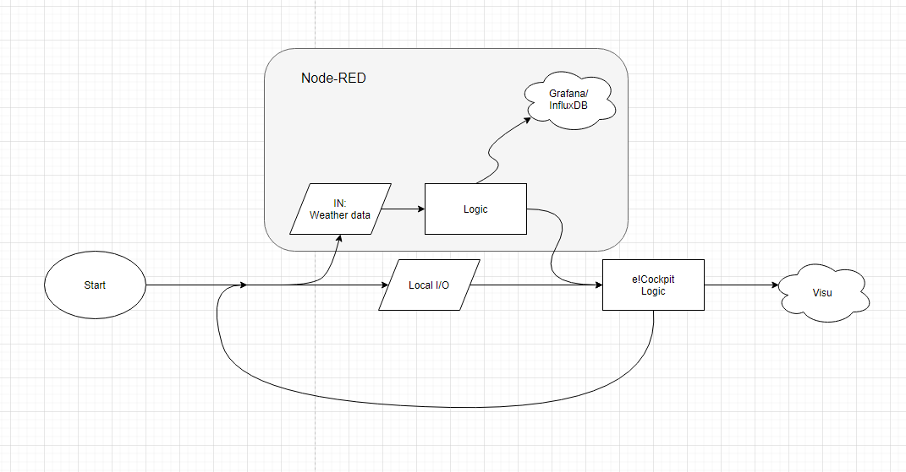

# Automated Driveway
This is an example project that connects a garage and driveway with automation and IT. In this project a Wago PFC200 is used 
to observe weather forecasts and to control heating, in addition to visualizations. The project uses traditional controller 
programming, butalso includes newer, less conventional and object-oriented approaches. The meaning of this project, is to
illustrate how these newer approches can be used, while still having the more traditional and "safe" ways as a base.

  

Most of the logic is being controlled from the CODESYS environment hosted on the PLC. The PLC also hosts a Node-RED container, 
which requests and parses weather data from YR.no. This data is then transmitted to the CODESYS environment through an OPC UA-
server hosted on the controller. Heating is then controlled from the PLC's I/O, and data is transmitted to the cloud. 

`Håkon Skaug.`
